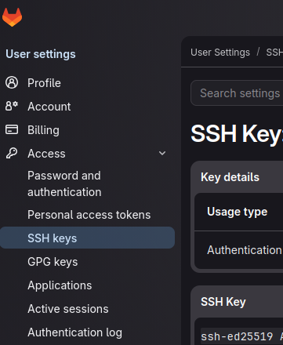
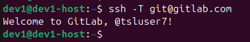
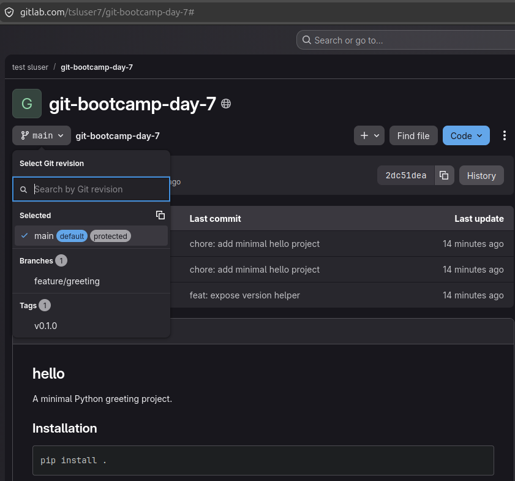
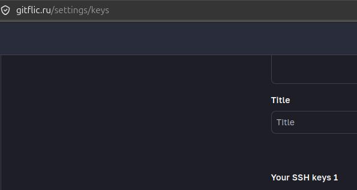
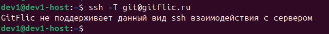
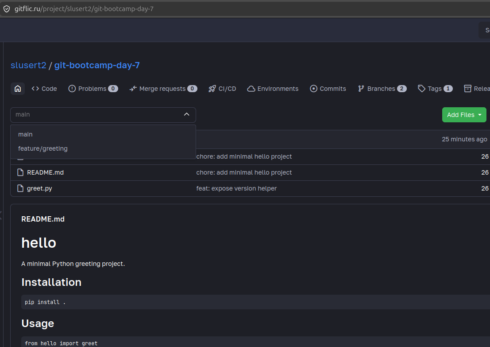
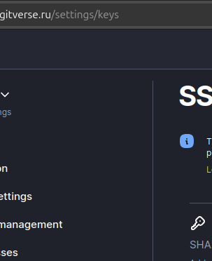
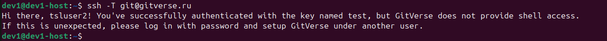
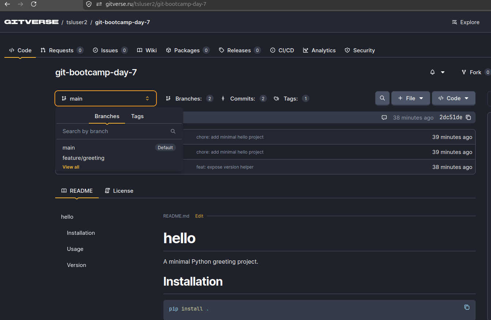

# LAB — день 7

## Базовая задача — `01-platforms-tour`

### Ссылки на репозитории

| Платформа | URL |
|-----------|-----|
| GitHub (основной) | https://github.com/slurmptemp/git-bootcamp-day-7 |
| GitLab | https://gitlab.com/tsluser7/git-bootcamp-day-7 |
| GitFlic | https://gitflic.ru/project/slusert2/git-bootcamp-day-7 |
| GitVerse | https://gitverse.ru/tsluser2/git-bootcamp-day-7 |

### GitLab — скриншоты (3)

1. SSH-ключ в UI:



2. Терминал `ssh -T`:



3. Репозиторий после push (ветки + тег):



### GitFlic — скриншоты (3)

1. SSH-ключ в UI:



2. Терминал `ssh -T`:



3. Репозиторий после push:



### GitVerse — скриншоты (3)

1. SSH-ключ в UI:



2. Терминал `ssh -T`:



3. Репозиторий после push:



### Таблица сравнения платформ

| Возможность | GitHub | GitLab | GitFlic | GitVerse |
|-------------|--------|--------|---------|----------|
| SSH-ключ через UI | да | да | да | да |
| Markdown render в README | да | да | да | да |
| Issues встроены | да | да | да | да |
| PR / Merge Request | PR | MR | MR | MR |
| Встроенный CI | Actions | Gitlab CI | Gitflic CI | Gitverse CI |
| Релизы / теги в UI | да | да | да | да|
| Видимость для незалогиненных | да | да | да | да |
| Что-то особенное | GitHub Actions и Copilot. Периодические региональные сложности с доступом. | All-in-one package: Container Registry, Package Registry, Wiki, Issues, Milestones, Boards. | Данные в России. Собственный пайплайн-движок. | Инфраструктура на серверах Cloud.ru. ИИ-ассистент GigaCode. |

### Команды

```bash
git remote add gitlab 'git@gitlab.com:tsluser7/git-bootcamp-day-7.git'
git remote add gitflic 'git@gitflic.ru:slusert2/git-bootcamp-day-7.git'
git remote add gitverse 'git@gitverse.ru:tsluser2/git-bootcamp-day-7.git'

➜  git-bootcamp-day-7 git:(main) git push gitlab --tags          
Enumerating objects: 1, done.
Counting objects: 100% (1/1), done.
Writing objects: 100% (1/1), 173 bytes | 173.00 KiB/s, done.
Total 1 (delta 0), reused 0 (delta 0), pack-reused 0
To gitlab.com:tsluser7/git-bootcamp-day-7.git
 * [new tag]         v0.1.0 -> v0.1.0
➜  git-bootcamp-day-7 git:(main) 

➜  git-bootcamp-day-7 git:(main) git push gitflic --tags          
Enumerating objects: 1, done.
Counting objects: 100% (1/1), done.
Writing objects: 100% (1/1), 173 bytes | 173.00 KiB/s, done.
Total 1 (delta 0), reused 0 (delta 0), pack-reused 0
remote: Updating references: 100% (1/1)
To gitflic.ru:slusert2/git-bootcamp-day-7.git
 * [new tag]         v0.1.0 -> v0.1.0
➜  git-bootcamp-day-7 git:(main) 
➜  git-bootcamp-day-7 git:(main) git push gitverse --tags          
Enumerating objects: 1, done.
Counting objects: 100% (1/1), done.
Writing objects: 100% (1/1), 173 bytes | 173.00 KiB/s, done.
Total 1 (delta 0), reused 0 (delta 0), pack-reused 0
remote: . Processing 1 references
remote: Processed 1 references in total
To gitverse.ru:tsluser2/git-bootcamp-day-7.git
 * [new tag]         v0.1.0 -> v0.1.0
➜  git-bootcamp-day-7 git:(main) 


dev1@dev1-host:~$ ssh -T git@gitlab.com
Welcome to GitLab, @tsluser7!
dev1@dev1-host:~$ 

dev1@dev1-host:~$ ssh -T git@gitflic.ru
GitFlic не поддерживает данный вид ssh взаимодействия с сервером
dev1@dev1-host:~$ 

dev1@dev1-host:~$ ssh -T git@gitverse.ru
Hi there, tsluser2! You've successfully authenticated with the key named test, but GitVerse does not provide shell access.
If this is unexpected, please log in with password and setup GitVerse under another user.
dev1@dev1-host:~$
```

### Впечатления (2–3 предложения)

На первый взгляд сложно сказать, глобально явного отличия не зафиксировал, gitlab, github интерфейс более привычен.

---